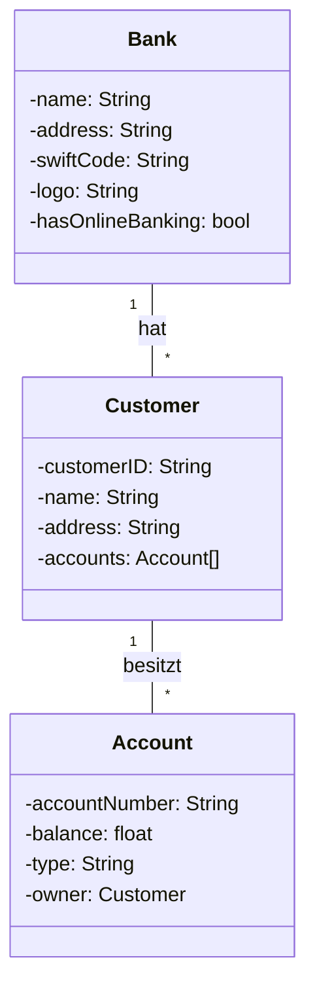

# Banksystem Architektur

## Klassendiagramm



## Beschreibung der Komponenten

### Bank
- Repräsentiert das Bankinstitut selbst
- Speichert grundlegende Informationen wie Name, Adresse und SWIFT-Code
- Optional: Online-Banking-Funktionalität

### Customer (Kunde)
- Repräsentiert einen Bankkunden
- Enthält persönliche Informationen
- Aggregiert mehrere Konten

### Account (Konto)
- Repräsentiert ein Bankkonto
- Enthält Kontostand und Kontotyp
- Gehört zu einem Kunden

## Implementierungsstruktur

```
bank/
├── __init__.py
├── bank.py
├── customer.py
└── account.py