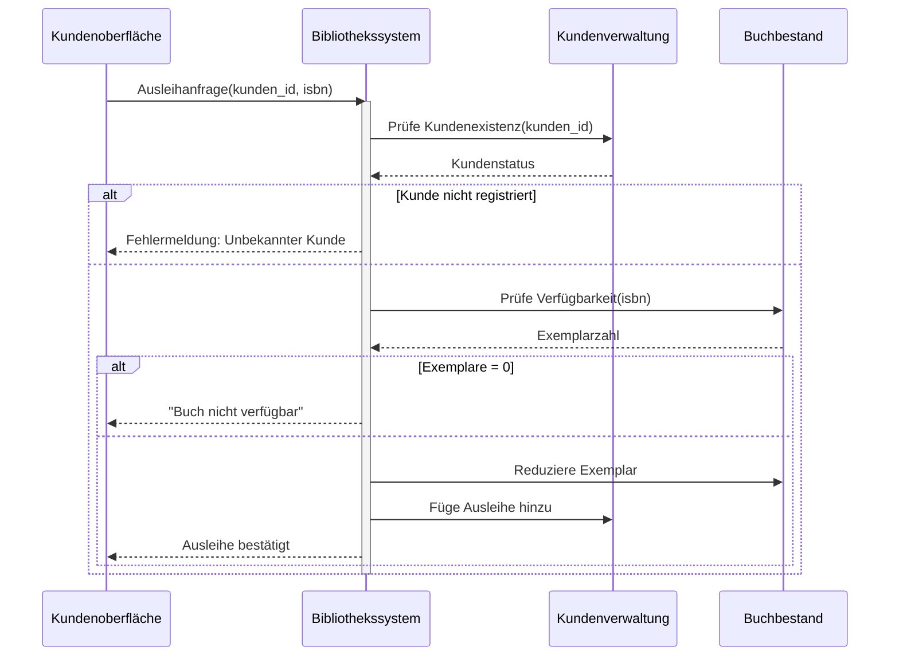

# Sequenzdiagramm Buchausleihe

## Erklärung der Interaktionen

1. **Ausleihanfrage Initiation**  
   Der Kunde sendet eine Anfrage mit seiner ID und der Buch-ISBN

2. **Kundenvalidierung**  
   Das System prüft in der Kunden-DB die Registrierung

3. **Buchverfügbarkeitscheck**  
   Bei gültigem Kunden wird der Buchbestand geprüft

4. **Kritische Pfade**  
   - Rote Route: Ungültige Kunden-ID
   - Gelbe Route: Keine verfügbaren Exemplare
   - Grüne Route: Erfolgreiche Ausleihe

5. **Transaktionsabschluss**  
   Bei Erfolg wird der Bestand aktualisiert und die Ausleihe registriert