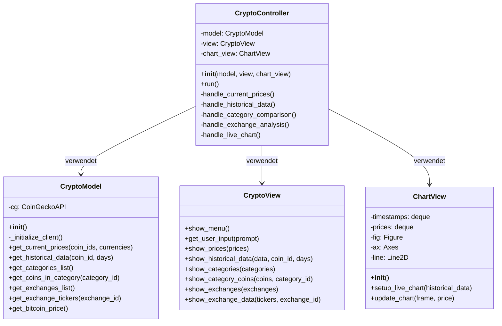
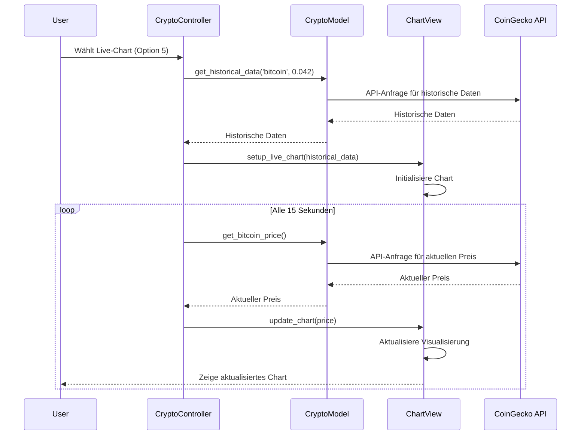

# 🚀 CryptoApp - Kryptowährungs-Analysetool

Eine Python-basierte Anwendung zur Analyse und Visualisierung von Kryptowährungsdaten unter Verwendung der CoinGecko API. Implementiert nach dem Model-View-Controller (MVC) Pattern.

## 📋 Funktionen

- 📊 Aktuelle Kryptowährungspreise abrufen
- 📈 Historische Preisentwicklungen analysieren
- 🔍 Kategorienbasierte Coin-Vergleiche
- 💹 Börsenhandelsdaten untersuchen
- ⚡ Live Bitcoin-Preisdiagramm

## 📊 Klassendiagramm



## 🔄 Sequenzdiagramm (Live-Chart-Beispiel)



## 🏗️ Projektstruktur

```
crypto_app/
├── models/               # Datenmodelle und API-Kommunikation
│   ├── __init__.py
│   └── crypto_model.py
├── views/               # Benutzeroberfläche und Visualisierungen
│   ├── __init__.py
│   ├── crypto_view.py
│   └── chart_view.py
├── controllers/         # Programmsteuerung
│   ├── crypto_controller.py
├── __init__.py
├── main.py             # Hauptprogramm
└── README.md
```

## 🔧 Installation

1. Stellen Sie sicher, dass Python 3.x installiert ist
2. Installieren Sie die erforderlichen Pakete:
```bash
pip install pycoingecko matplotlib
```

3. Setzen Sie Ihren CoinGecko API-Schlüssel als Umgebungsvariable:
```bash
# Windows
set COINGECKO_API_KEY=ihr_api_schlüssel

# Unix/Linux/macOS
export COINGECKO_API_KEY=ihr_api_schlüssel
```

## 🚦 Programmstart

```bash
python main.py
```

## 💻 Nutzung

1. **Aktuelle Preise**
   - Option 1 wählen
   - Coin-IDs eingeben (z.B. bitcoin,ethereum)
   - Währungen eingeben (z.B. usd,eur)

2. **Historische Daten**
   - Option 2 wählen
   - Coin-ID und Zeitraum angeben

3. **Kategorienvergleich**
   - Option 3 wählen
   - Aus verfügbaren Kategorien wählen

4. **Börsenanalyse**
   - Option 4 wählen
   - Börse aus Liste auswählen

5. **Live-Chart**
   - Option 5 wählen
   - Bitcoin-Preis wird live angezeigt

## 🏛️ Architektur

### Model (crypto_model.py)
- Handhabt alle API-Kommunikation
- Verarbeitet und validiert Daten
- Implementiert Geschäftslogik

### Views (crypto_view.py, chart_view.py)
- Benutzerinteraktion via Konsolenschnittstelle
- Datenvisualisierung mit matplotlib
- Formatierte Ausgabe von Informationen

### Controller (crypto_controller.py)
- Koordiniert Model und Views
- Verarbeitet Benutzereingaben
- Steuert Programmablauf

## ⚠️ Fehlerbehandlung

- API-Schlüssel-Validierung
- Netzwerkfehler-Management
- Eingabevalidierung
- Datenqualitätsprüfung

## 🔄 Updates & Wartung

Die MVC-Architektur ermöglicht:
- Einfache Erweiterbarkeit
- Modulare Updates
- Unabhängige Komponententests
- Klare Trennung der Zuständigkeiten

## 📝 Lizenz

MIT License - Siehe LICENSE-Datei für Details.