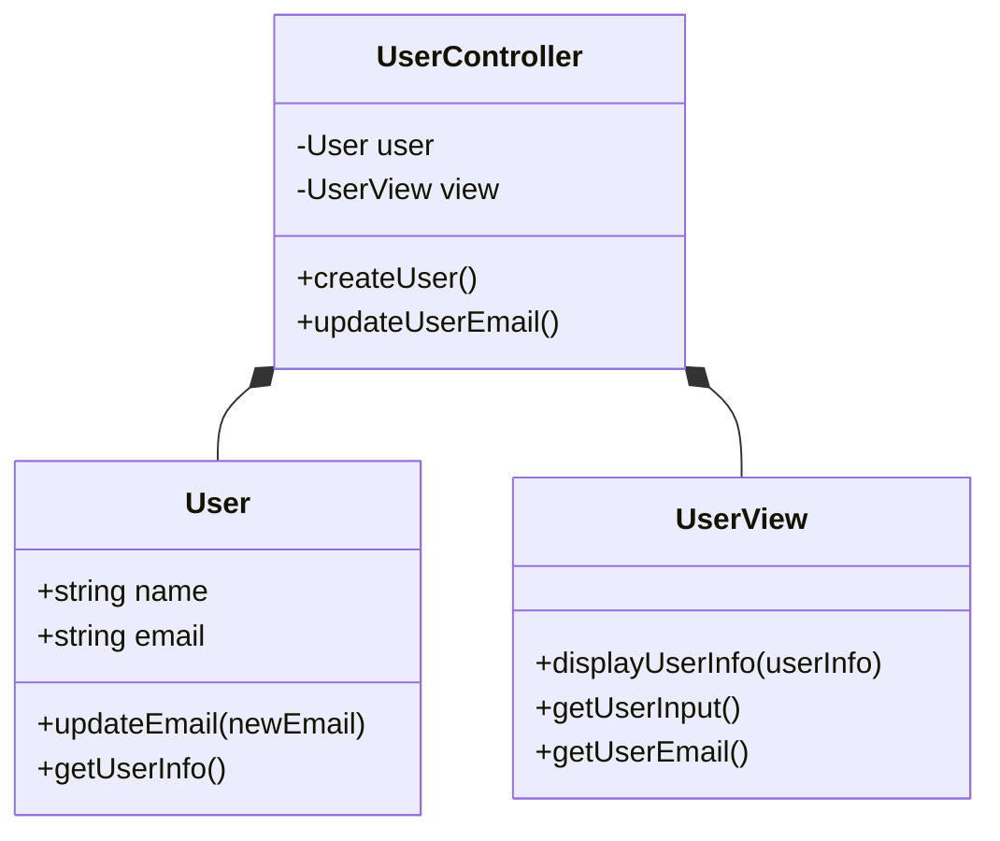
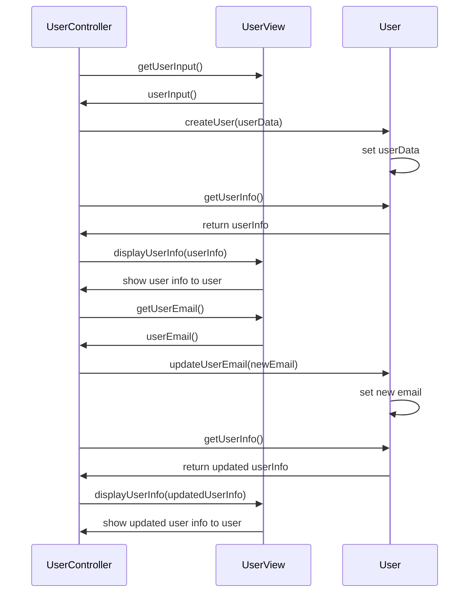

# Model-View-Controller (MVC)

## Einführung

Das **Model-View-Controller (MVC)**-Muster ist ein Softwarearchitektur-Muster, das häufig in der Entwicklung von Anwendungen verwendet wird, um die Trennung von Logik, Benutzeroberfläche und Eingabe zu gewährleisten. Es ermöglicht eine klare Trennung zwischen der Darstellung der Benutzeroberfläche (View), der Geschäftslogik (Model) und der Interaktion zwischen diesen (Controller).

### Bestandteile des MVC-Musters:

1. **Model**: Repräsentiert die Daten und die Geschäftslogik der Anwendung. Es kommuniziert mit der Datenbank und führt alle erforderlichen Berechnungen durch.
2. **View**: Präsentiert die Daten und stellt die Benutzeroberfläche zur Verfügung. Sie empfängt keine direkte Logik und ist lediglich für die Darstellung verantwortlich.
3. **Controller**: Verbindet das Model und die View. Es verarbeitet Eingaben des Benutzers, ändert die Daten im Model und aktualisiert die View.

### Vorteile des MVP-Musters:

1. **Bessere Trennung der Verantwortlichkeiten:**
   - Der Presenter übernimmt alle logischen Aufgaben und trennt diese klar von der View. Dadurch sind Geschäftslogik und UI-Logik vollständig getrennt, was die Wartbarkeit und Erweiterbarkeit des Codes verbessert.
   - Die View enthält nur minimale Logik und kümmert sich hauptsächlich um die Darstellung von Informationen.

2. **Testbarkeit:**
   - Da die Logik des Presenters unabhängig von der Benutzeroberfläche (UI) ist, lässt sich der Presenter leicht testen, ohne die View oder die UI zu benötigen. Dies ermöglicht Unit-Tests der Geschäftslogik ohne aufwendige Mock-Objekte für die UI.
   - Die View kann einfach durch Mocking ersetzt werden, wodurch Testfälle für den Presenter und das Model unkompliziert durchgeführt werden können.

3. **Erhöhte Flexibilität bei der Benutzeroberfläche:**
   - Die View ist vollständig von der Logik des Presenters getrennt, was es ermöglicht, verschiedene Views (z. B. Web, Mobile, Desktop) zu entwickeln, ohne den Presenter ändern zu müssen. Nur die View-Komponente muss für verschiedene Plattformen angepasst werden.
   - Die Benutzeroberfläche (UI) kann leicht durch eine andere View-Implementierung ersetzt werden, ohne die Kernlogik zu beeinträchtigen.

4. **Einfachere Wartbarkeit und Erweiterbarkeit:**
   - Da das MVP-Muster eine klare Trennung von Verantwortlichkeiten bietet, können Änderungen an der Logik der Anwendung (im Presenter) oder der Darstellung (in der View) unabhängig voneinander durchgeführt werden.
   - Neue Funktionen oder Änderungen im Business-Logikbereich können ohne Auswirkungen auf die Benutzeroberfläche vorgenommen werden, was zu einer leichteren Wartung führt.

5. **Geringere Abhängigkeiten:**
   - Der Presenter ist die einzige Komponente, die mit dem Model und der View kommuniziert. Dadurch reduziert sich die Anzahl der Abhängigkeiten zwischen den verschiedenen Komponenten des Systems, was die Komplexität des Systems reduziert und es einfacher macht, Änderungen vorzunehmen.

6. **Verbesserte Wiederverwendbarkeit der Komponenten:**
   - Da der Presenter und das Model von der View getrennt sind, können sie leicht in verschiedenen Kontexten oder Projekten wiederverwendet werden. Nur die View muss für jede spezifische Benutzeroberfläche angepasst werden, während die Logik des Presenters unverändert bleiben kann.

7. **Erleichterte Implementierung von komplexen Benutzeroberflächen:**
   - In komplexen UI-Designs mit vielen interaktiven Elementen und Benutzereingaben hilft MVP, den Code klar und strukturiert zu halten. Der Presenter kann die Eingaben des Benutzers verarbeiten und die erforderlichen Updates an das Model und die View weitergeben.

## Ordnerstruktur

Eine mögliche Ordnerstruktur für die Implementierung eines MVC-Designs in Python könnte etwa folgendermaßen aussehen:
```plaintext
myapp/
    ├── model/
    │   └── user.py
    ├── view/
    │   └── userView.py
    ├── controller/
    │   └── userController.py
    └── main.py

```

## Klassendiagramm:


## Sequenzdiagramm:

### Aufgabe: Implementierung eines einfachen MVC-Designs in Python

In dieser Aufgabe werden Sie ein einfaches User-Management-System unter Verwendung des MVC-Designs (Model-View-Controller) in Python implementieren. Ihr werdet die einzelnen Komponenten des MVC-Designs erstellen: 

1. **Model**: Das `User`-Modell, das die Benutzerinformationen enthält.
2. **View**: Eine `UserView`, die die Benutzerdaten darstellt.
3. **Controller**: Ein `UserController`, der das Model verwaltet und die Kommunikation zwischen Model und View übernimmt.

#### Schritte zur Implementierung:

1. **Erstellen des Models (user.py)**:
   - Definiert eine Klasse `User`, die die Benutzerinformationen wie `name` und `email` speichert.
   - Fügt Methoden hinzu, um die Benutzerinformationen zu ändern (`updateEmail`) und die Benutzerinformationen abzurufen (`getUserInfo`).

    ```python
    # user.py
    # Hinweis: enthält lediglich Daten - weder Konsolenein- noch ausgabe (= strikte Trennung der Verantwortungsbereiche einzelner Klassen)!
    class User:
        def __init__(self, name, email):
            # Attribute zuweisen
        
        def updateEmail(self, newEmail):
            # Email-Adresse ändern
        
        def getUserInfo(self):
            # Infos zu User zurückgeben
    ```

2. **Erstellen der View (userView.py)**:
   - Definiert eine Klasse `UserView`, die für die Ausgabe der Benutzerdaten verantwortlich ist.
   - Die Klasse sollte Methoden zum Anzeigen von Benutzerinformationen (`displayUserInfo`) und zum Empfangen von Benutzereingaben (`getUserInput`) enthalten.

    ```python
    # userView.py
    # für Nutzerein- und ausgaben!
    class UserView:
        def displayUserInfo(self, userInfo):
            # Informationen über den User in Konsole ausgeben!
        
        def getUserInput(self):
            # Nutzereingaben (hier über Konsole, da keine GUI) und vornehmen und zurückgeben!
        def getUserEmail(self):
	        # Nutzer gibt neue Email-Adresse ein - Wert wird zurückgegeben!
    ```

3. **Erstellen des Controllers (userController.py)**:
   - Definiert eine Klasse `UserController`, die das Model (`User`) und die View (`UserView`) verwaltet.
   - Fügt Methoden zum Erstellen eines Benutzers (`createUser`) und zum Aktualisieren der E-Mail-Adresse eines Benutzers (`updateUserEmail`) hinzu.

    ```python
    # userController.py
    from model.user import User
    from view.userView import UserView
    
    # Verbindungsglied zwischen Model & View!
    class UserController:
        def __init__(self):
            self.user = None # zu Beginn noch kein User vorhanden (*)
            self.view = None # (*)
        
        def createUser(self):
            # User erstellen und Daten in Konsole ausgeben!
        
        def updateUserEmail(self):
            # Email-Adresse aktualisieren!
    ```

4. **Hauptprogramm (main.py)**:
   - Im Hauptprogramm (`main.py`) erstellt ihr eine Instanz des `UserController` und ruft die entsprechenden Methoden auf, um einen Benutzer zu erstellen und die E-Mail zu aktualisieren.

    ```python
    # main.py
    from controller.userController import UserController
    
    if __name__ == "__main__":
        controller = UserController()
        
        # Benutzer erstellen
        controller.createUser()
        
        # Benutzer-E-Mail aktualisieren
        controller.updateUserEmail()
    ```

#### Aufgabenstellung *(30 min.)*:
1. Erstellt die oben beschriebenen Python-Dateien für das Model, die View und den Controller.
2. Implementiert alle erforderlichen Methoden, um einen Benutzer zu erstellen und die E-Mail-Adresse zu aktualisieren.
3. Testet die Anwendung, indem ihr einen Benutzer erstellt und anschließend die E-Mail-Adresse ändert.
4. Dokumentiert den Code, um zu erklären, wie die einzelnen Komponenten des MVC-Designs zusammenarbeiten.

#### Ziel:
Nach der Durchführung dieser Aufgabe habt ihr ein grundlegendes Verständnis des MVC-Designs und der Trennung von Verantwortlichkeiten in einer Python-Anwendung erlangt. Ihr habt auch die Fähigkeiten entwickelt, eine einfache Anwendung mit diesem Design-Muster zu erstellen und zu testen.


## Weitere Design-Pattern

### Kategorien:

1. **Creational Patterns (Erzeugungsmuster)**:
   Diese Muster befassen sich mit der Instanziierung von Objekten. Sie bieten Lösungen für die Erstellung von Objekten und steuern die Art und Weise, wie Objekte erzeugt werden.
   
   - **Singleton**: Stellt sicher, dass eine Klasse nur ein einziges Exemplar hat und bietet einen globalen Zugriffspunkt auf dieses Exemplar.
   - **Factory Method**: Definiert eine Methode zum Erzeugen von Objekten, ohne die konkrete Klasse des Objekts anzugeben.
   - **Abstract Factory**: Ermöglicht das Erzeugen von Familien von verwandten Objekten ohne deren konkrete Klassen zu spezifizieren.
   - **Builder**: Trennt die Konstruktion eines komplexen Objekts von seiner Darstellung.
   - **Prototype**: Erlaubt das Erstellen von Objekten durch Kopieren eines bestehenden Objekts (Prototyps).

2. **Structural Patterns (Strukturmuster)**:
   Diese Muster beschäftigen sich mit der Zusammensetzung von Klassen und Objekten, um größere Strukturen zu schaffen. Sie bieten Lösungen für die Organisation und Komposition von Objekten.
   
   - **Adapter**: Ermöglicht es, dass zwei inkompatible Schnittstellen miteinander arbeiten.
   - **Bridge**: Trennen die abstrakte Klasse von der konkreten Implementierung, um beide unabhängig voneinander weiterentwickeln zu können.
   - **Composite**: Ermöglicht das Erstellen von Baumstrukturen, in denen Objekte und deren Gruppen gleich behandelt werden.
   - **Decorator**: Fügt einem Objekt dynamisch zusätzliche Funktionalitäten hinzu.
   - **Facade**: Bietet eine vereinfachte Schnittstelle zu einem komplexen System.
   - **Flyweight**: Reduziert den Speicherbedarf, indem identische Objekte gemeinsam genutzt werden.
   - **Proxy**: Stellt ein Stellvertreterobjekt zur Verfügung, das den Zugriff auf ein anderes Objekt kontrolliert.

3. **Behavioral Patterns (Verhaltensmuster)**:
   Diese Muster konzentrieren sich auf die Interaktionen zwischen Objekten und deren Kommunikation. Sie helfen dabei, die Flexibilität der Kommunikation zu erhöhen und die Verantwortlichkeiten zu verteilen.
   
   - **Chain of Responsibility**: Ermöglicht es, eine Anfrage durch eine Reihe von Handlern weiterzugeben, ohne dass der Sender von der konkreten Klasse des Handlers wissen muss.
   - **Command**: Kapselt eine Anfrage als Objekt, wodurch der Aufrufer und der Empfänger der Anfrage entkoppelt werden.
   - **Interpreter**: Definiert eine Grammatik und interpretiert Ausdrücke in dieser Sprache.
   - **Iterator**: Ermöglicht den sequenziellen Zugriff auf die Elemente einer Sammlung, ohne deren interne Struktur offenzulegen.
   - **Mediator**: Vermittelt die Kommunikation zwischen Objekten, um direkte Abhängigkeiten zu vermeiden.
   - **Memento**: Speichert den Zustand eines Objekts, sodass es später in diesen Zustand zurückversetzt werden kann.
   - **Observer**: Ermöglicht es, dass ein Objekt (Subjekt) die Änderungen an seinem Zustand an eine Gruppe von abhängigen Objekten (Beobachter) weitergibt.
   - **State**: Ermöglicht einem Objekt, sein Verhalten basierend auf seinem internen Zustand zu ändern.
   - **Strategy**: Definiert eine Familie von Algorithmen, die austauschbar sind und die für eine bestimmte Aufgabe genutzt werden können.
   - **Template Method**: Definiert das Grundgerüst eines Algorithmus und lässt einige Schritte der Implementierung in Unterklassen.
   - **Visitor**: Erlaubt es, neue Operationen auf Objekten zu definieren, ohne deren Klassen zu ändern.

4. **Concurrency Patterns (Nebenläufigkeitsmuster)**:
   Diese Muster helfen bei der Organisation und Verwaltung von parallelen Prozessen und Threads.
   
   - **Thread Pool**: Verwalten eine Gruppe von Threads, die wiederverwendet werden können, um Aufgaben zu erledigen, ohne für jede Aufgabe einen neuen Thread zu erzeugen.
   - **Active Object**: Entkoppelt Methodenaufrufe von der Ausführung, indem sie in ein separates Objekt ausgelagert werden.
   - **Balking**: Verhindert, dass eine Methode ausgeführt wird, wenn ein bestimmter Zustand nicht erreicht wurde.
   - **Guarded Suspension**: Ermöglicht es, eine Aufgabe nur dann auszuführen, wenn eine Bedingung erfüllt ist.
   - **Monitor Object**: Stellt sicher, dass nur ein Thread gleichzeitig auf ein Objekt zugreifen kann, um Datenrennen zu verhindern.

5. **Architectural Patterns (Architekturpatterns)**:
   Diese Muster helfen dabei, die Gesamtstruktur von Systemen zu organisieren.
   
   - **MVC (Model-View-Controller)**: Trennt die Daten, die Benutzeroberfläche und die Eingaben von der Logik, um die Wartbarkeit und Erweiterbarkeit zu verbessern.
   - **MVVM (Model-View-ViewModel)**: Eine Variante des MVC, bei der das ViewModel die Kommunikation zwischen Model und View übernimmt und eine Trennung der UI-Logik ermöglicht.
   - **Layered Pattern**: Organisiert eine Anwendung in Schichten, wobei jede Schicht eine bestimmte Funktionalität anbietet (z. B. Präsentation, Geschäftslogik, Datenzugriff).

>**Anmerkung**: Wenn hierbei weiterführendes Interesse besteht, empfehle ich Ihnen die Seite [Refactoring.guru](https://refactoring.guru/design-patterns)